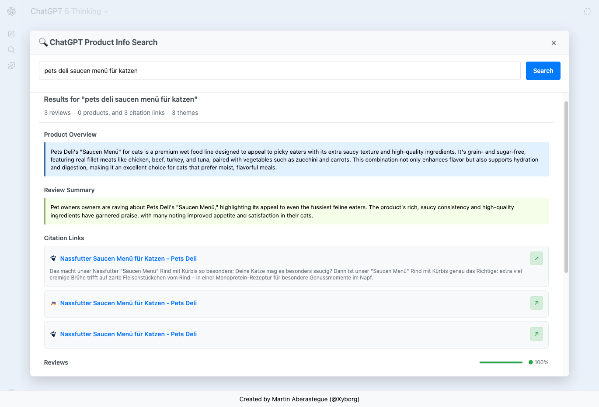
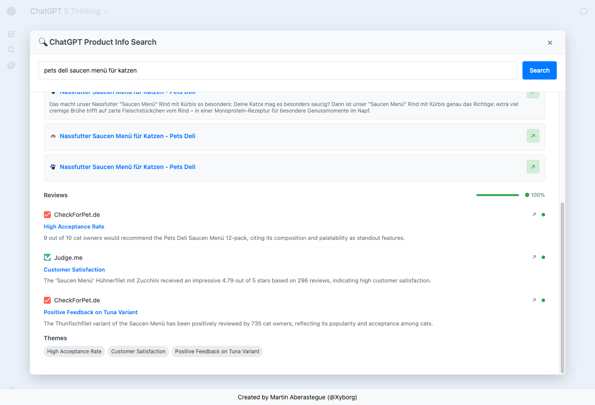

# ChatGPT Product Info Search 🔍

This is a browser script that unlocks ChatGPT's internal product search API to fetch detailed product information, reviews, and comparisons directly within ChatGPT's interface.



## Overview

This script creates a modal interface within ChatGPT that allows you to search for product information, reviews, and detailed comparisons by leveraging ChatGPT's internal product search API. It automatically handles authentication and presents results in an organized, easy-to-read format.

## Demo

https://github.com/user-attachments/assets/b5472c48-1cd9-496b-b120-3fd548582f9f

## Features

- **Product Search**: Search for any product using natural language queries
- **Comprehensive Results**: Get product details, reviews, ratings, and merchant offers
- **Review Analysis**: Sentiment analysis with positive/negative/neutral breakdown
- **Citation Links**: Direct links to source websites and reviews
- **Auto Authentication**: Automatically fetches your ChatGPT session token
- **Real-time Results**: Live streaming of search results as they come in

## How to Use

### Method 1: Browser Console (Recommended)

1. **Open ChatGPT** in your browser and make sure you're logged in
2. **Open Developer Tools**:
   - **Chrome/Edge**: Press `F12` or `Ctrl+Shift+I` (Windows) / `Cmd+Option+I` (Mac)
   - **Firefox**: Press `F12` or `Ctrl+Shift+I` (Windows) / `Cmd+Option+I` (Mac)
   - **Safari**: Press `Cmd+Option+I` (Mac) - you may need to enable Developer Tools first
3. **Go to Console tab** in the Developer Tools
4. **Copy the entire content of the script** from `chatgpt-product-info.js`
5. **Paste and press Enter** - the modal will appear immediately
6. **Start searching** for products!

### Method 2: Bookmarklet

Due to CORS restrictions, you'll need to create a proper bookmarklet using a bookmarklet generator:

1. **Copy the entire script** from `chatgpt-product-info.js`
2. **Go to a bookmarklet generator**:
   - [Bookmarkleter](https://chriszarate.github.io/bookmarkleter) (Recommended)
   - [Bookmarklet Maker](https://caiorss.github.io/bookmarklet-maker)
3. **Paste the script** into the generator
4. **Generate the bookmarklet** - it will create a `javascript:` URL
5. **Create a new bookmark** in your browser with:
   - **Name**: "ChatGPT Product Search" 
   - **URL**: The generated `javascript:` code
6. **Visit ChatGPT** and click the bookmark to launch the search tool

**Note**: The bookmarklet will be quite long due to the script size, but it will work properly without CORS issues.

## Search Examples

Try these search queries to see the power of the tool:

- `"iPhone 17 Pro camera quality"`
- `"Nike Air Max running shoes"`
- `"MacBook Air M3 performance"`
- `"Tesla Model 3 reviews"`
- `"Pets Deli Hundefutter"`

## What You'll Get

### Product Information
- **Product Details**: Title, price, description, ratings when available.

### Review Analysis
- **Review Summary**: AI-generated overview of all reviews
- **Sentiment Breakdown**: Visual representation of positive/negative/neutral reviews
- **Review Themes**: Common topics mentioned across reviews
- **Source Citations**: Direct links to original review sources



### Additional Data
- **Product Overview**: AI rationale explaining the product category
- **Citation Links**: All source websites with favicons and snippets

## Technical Details

### How It Works

The script leverages ChatGPT's internal `/backend-api/search/product_info` endpoint, which is the same API that powers ChatGPT's built-in product search functionality. It:

1. **Authenticates** using your existing ChatGPT session
2. **Sends search queries** to ChatGPT's product API
3. **Parses streaming responses** in real-time
4. **Extracts structured data** including products, reviews, and citations
5. **Renders results** in a beautiful, organized interface

### API Endpoint
```
POST https://chatgpt.com/backend-api/search/product_info
```

### Authentication
The script automatically fetches your session token from `/api/auth/session` - no manual token input required!

### Data Structure
The API returns structured data including:
- Product entities with pricing and merchant information
- Review summaries with sentiment analysis
- Citation links to source websites
- Rationale and summary text

## Browser Compatibility

- ✅ **Chrome** (Recommended)
- ✅ **Firefox**
- ✅ **Safari**
- ✅ **Opera**

## Requirements

- Active ChatGPT account (free or paid)
- Modern web browser with JavaScript enabled
- Must be used on chatgpt.com domain

## Troubleshooting

### "Failed to get authentication token"
- Make sure you're logged in to ChatGPT
- Refresh the ChatGPT page and try again
- Check that you're on the correct chatgpt.com domain

### "No results found"
- Try different search terms
- Use more specific product names
- Include brand or product names in your search

### Modal doesn't appear
- Make sure JavaScript is enabled
- Check browser console for errors
- Try refreshing the page and running the script again

## Privacy & Security

- **No data collection**: The script runs entirely in your browser
- **Uses your session**: Leverages your existing ChatGPT authentication
- **No external servers**: All requests go directly to ChatGPT's API
- **It wont mess with your chat history**: This won't create new chats, so you won't see it in your history.
- **Open source**: Full code is available for inspection

## Contributing

Feel free to submit issues, feature requests, or pull requests on GitHub!

## Author

Created by [Martin Aberastegue (@Xyborg)](https://www.martinaberastegue.com/)

## License

MIT License - feel free to modify and use as needed!

---

**Note**: This tool uses ChatGPT's internal API and is intended for educational and personal use. Please respect ChatGPT's terms of service.
